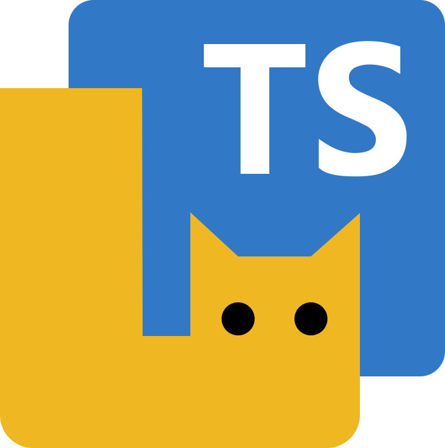

<p align="center">
  
</p>

# `@gwigz/slua-*`

LSL type definitions and a [TypeScript-to-Lua](https://typescripttolua.github.io) plugin for Second Life. Full editor support, compile-time safety, minimal runtime overhead.

If TypeScript is where you're productive, you don't need to learn a new language to script for Second Life. SLua has decent tooling, but this lets you stay in the ecosystem you already know.

## Packages

| Package                                           | Description                                                   |
| ------------------------------------------------- | ------------------------------------------------------------- |
| [`@gwigz/slua-types`](packages/types)             | Auto-generated TypeScript declarations for all SLua/LSL APIs  |
| [`@gwigz/slua-tstl-plugin`](packages/tstl-plugin) | TSTL plugin enforcing SLua constraints                        |
| [`@gwigz/slua-modules`](packages/modules)         | Shared runtime modules (config helpers, testing utilities)    |
| [`@gwigz/slua-create`](packages/create)           | CLI scaffolding tool for new SLua projects                    |
| [`@gwigz/slua-json`](packages/json)               | Tagged JSON codec for exchanging typed data with SLua scripts |

## Examples

I use this toolchain for my own projects, it's how I find the rough edges:

| Project                                                             | Description                                                                     |
| ------------------------------------------------------------------- | ------------------------------------------------------------------------------- |
| [`examples/sim-wide-relay`](examples/sim-wide-relay)                | Region-wide chat relay, deployed at my favorite sim                             |
| [`slua-derez-patcher`](https://github.com/gwigz/slua-derez-patcher) | Skips the rez-edit-take-replace cycle; patches rezzables using `ll.DerezObject` |

### Related Projects

These packages also pair well with the TSTL pipeline, and LSL HTTP-in features:

| Project                                                               | Description                                                                 |
| --------------------------------------------------------------------- | --------------------------------------------------------------------------- |
| [`tstl-bundle-flatten`](https://github.com/gwigz/tstl-bundle-flatten) | TSTL plugin that flattens `luaBundle` output, eliminating the module system |
| [`jsx-inline`](https://github.com/gwigz/jsx-inline)                   | Compiles JSX templates into optimized inline string literals                |
| [`slick-css`](https://github.com/gwigz/slick-css)                     | A shadcn-style classless CSS semantic component library                     |

## Quick Start

Scaffold a new project with the CLI:

```bash
bunx @gwigz/slua-create
```

This walks you through template selection, optional extras (JSX, config module, StyLua, linting), and generates a ready-to-build project.

### Manual Setup

Install the packages:

```bash
npm install --save-dev typescript typescript-to-lua @gwigz/slua-types @gwigz/slua-tstl-plugin
```

Create a `tsconfig.json` in your project:

```json
{
  "compilerOptions": {
    "target": "ESNext",
    "module": "ESNext",
    "strict": true,
    "moduleDetection": "force",
    "types": ["@typescript-to-lua/language-extensions", "@gwigz/slua-types"]
  },
  "tstl": {
    "luaTarget": "Luau",
    "luaLibImport": "inline",
    "luaPlugins": [{ "name": "@gwigz/slua-tstl-plugin" }],
    "extension": "slua"
  }
}
```

See [TypeScriptToLua configuration](https://typescripttolua.github.io/docs/configuration) for more config options.

### Editor & GitHub setup (optional)

Map `.slua` to Lua highlighting in VS Code (and forks):

```json
// .vscode/settings.json
{
  "files.associations": {
    "*.slua": "lua"
  }
}
```

Tell GitHub to highlight `.slua` files as Lua:

```ini
# .gitattributes
*.slua linguist-language=Lua
```

### Write TypeScript, compile to SLua

```typescript
const owner = ll.GetOwner()

LLEvents.on("touch_start", (events) => {
  for (const event of events) {
    const key = event.getKey()

    if (key === owner) {
      ll.Say(0, `Hello secondlife:///app/agent/${key}/about!`)

      return
    }
  }
})
```

Compile with `npx tstl` (or `bunx tstl`, `pnpm tstl`, etc.) to get:

```lua
local owner = ll.GetOwner()

LLEvents:on("touch_start", function(events)
    for ____, event in ipairs(events) do
        local key = event:getKey()

        if key == owner then
            ll.Say(0, ("Hello secondlife:///app/agent/" .. tostring(key)) .. "/about!")

            return
        end
    end
end)
```

### Plugin Transforms

The TSTL plugin automatically translates TypeScript patterns to native Luau/LSL equivalents for JSON, base64, string methods, array methods, bitwise operators, and floor division. See the [full transform reference](packages/tstl-plugin#transforms) for details.

### Comments

Due to a [TSTL limitation](https://github.com/TypeScriptToLua/TypeScriptToLua/issues/815), only valid JSDoc-style comments (`/** */`) are preserved in the output. Regular comments (`//`, `/* */`) are stripped:

```typescript
/** This comment will appear in the Lua output */
const owner = ll.GetOwner()

// This comment will be stripped
const pos = new Vector(128, 128, 20)
```

```lua
--- This comment will appear in the Lua output
local owner = ll.GetOwner()
local pos = vector.create(128, 128, 20)
```

# Resources

| Resource                                                           | Description                                     |
| ------------------------------------------------------------------ | ----------------------------------------------- |
| [Creator Portal](https://create.secondlife.com)                    | Second Life creator tools and documentation     |
| [VSCode Extension](https://github.com/secondlife/sl-vscode-plugin) | SLua language support for VS Code by Linden Lab |
| [LSL Definitions](https://github.com/secondlife/lsl-definitions)   | LSL and SLua API definitions by Linden Lab      |
