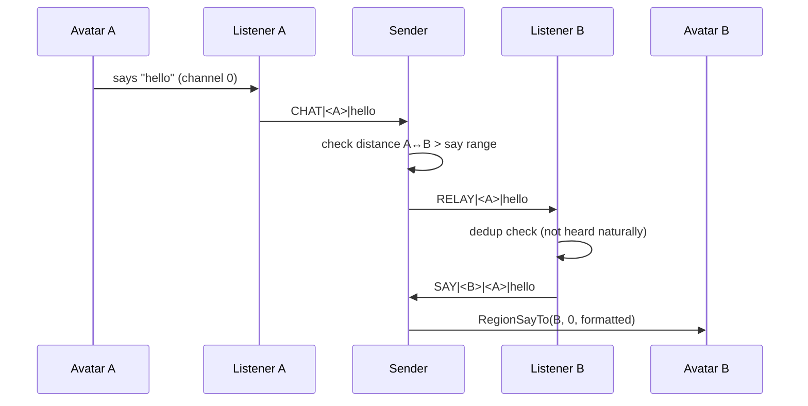

# Sim-Wide Chat Relay

Three-script relay system that extends public chat (channel 0) across an entire region. Each avatar is assigned a listener object that follows them, captures their chat, and relays it to avatars outside hearing range.

## How it works

1. **Coordinator** rezzes a pool of listener objects (batched to avoid event queue overflow)
2. When an avatar enters the region, the coordinator assigns a free listener and writes the mapping to linkset data
3. The **listener** follows its assigned avatar and forwards any chat to the sender via private channel
4. The **sender** (in the same linkset as the coordinator) resolves the speaker via linkset data, checks distances for all agents, and routes relay messages to out-of-range avatars' listeners
5. The receiving listener deduplicates against naturally heard chat, then sends the message back to the sender for delivery
6. The **sender** formats and delivers the message to the avatar via `llRegionSayTo`



## Scripts

- **`shared.ts`** -- Shared constants (`PRIVATE_CHANNEL`, `IGNORED_AVATARS`) and message signing (`sign`/`verify`)
- **`coordinator.ts`** -- Pool management, avatar polling, linkset data assignments
- **`listener.ts`** -- Follows assigned avatar, captures chat, deduplicates relayed messages
- **`sender.ts`** -- Routes chat between listeners based on distance, formats and delivers messages via `llRegionSayTo`

## Configuration

Edit `src/shared.ts` to customize:

- **`PRIVATE_CHANNEL`** -- Unique channel for inter-script communication. Change this per deployment to avoid conflicts.
- **`SIGN_NONCE`** -- Random integer used as the MD5 nonce for message signing. Change this to a unique value per deployment.
- **`IGNORED_AVATARS`** -- Array of avatar UUID strings to exclude from the relay (bots, alts, etc.). Ignored avatars won't be assigned listeners and their chat won't be relayed.

> **Note:** You should change `PRIVATE_CHANNEL` and `SIGN_NONCE` to unique values before deploying. For now it may be easier to edit these in the TypeScript source and rebuild, until we look into cleaner output for configurable globals.

## Message signing

Private channel messages are signed with a truncated MD5 hash (fast) and time-bucketed to limit replays. A bit overkill since the scripts already filter by owner, but cheap peace of mind.

## Features demonstrated

- **Linkset data** (`ll.LinksetDataWrite`, `ll.LinksetDataRead`) for shared state between scripts in the same object
- **`ll.GetAgentList`** for region-wide avatar detection
- **`ll.GetObjectDetails`** for position lookups and distance checks
- **`ll.RegionSayTo`** for targeted cross-region messaging
- **`ll.SetRegionPos`** for listener repositioning
- **`ll.RezObject`** for dynamic object creation
- **`ll.MD5String`** for message signing and verification
- **Timer events** for polling and following

## Setup

1. Place the coordinator and sender scripts in the same prim
2. Add the listener object (with the listener script) to the coordinator's inventory, named to match `LISTENER_OBJECT` in `coordinator.ts`
3. The coordinator will rez the pool automatically on startup

## Build

```bash
bun build.ts
```

Output is written to `dist/`.
