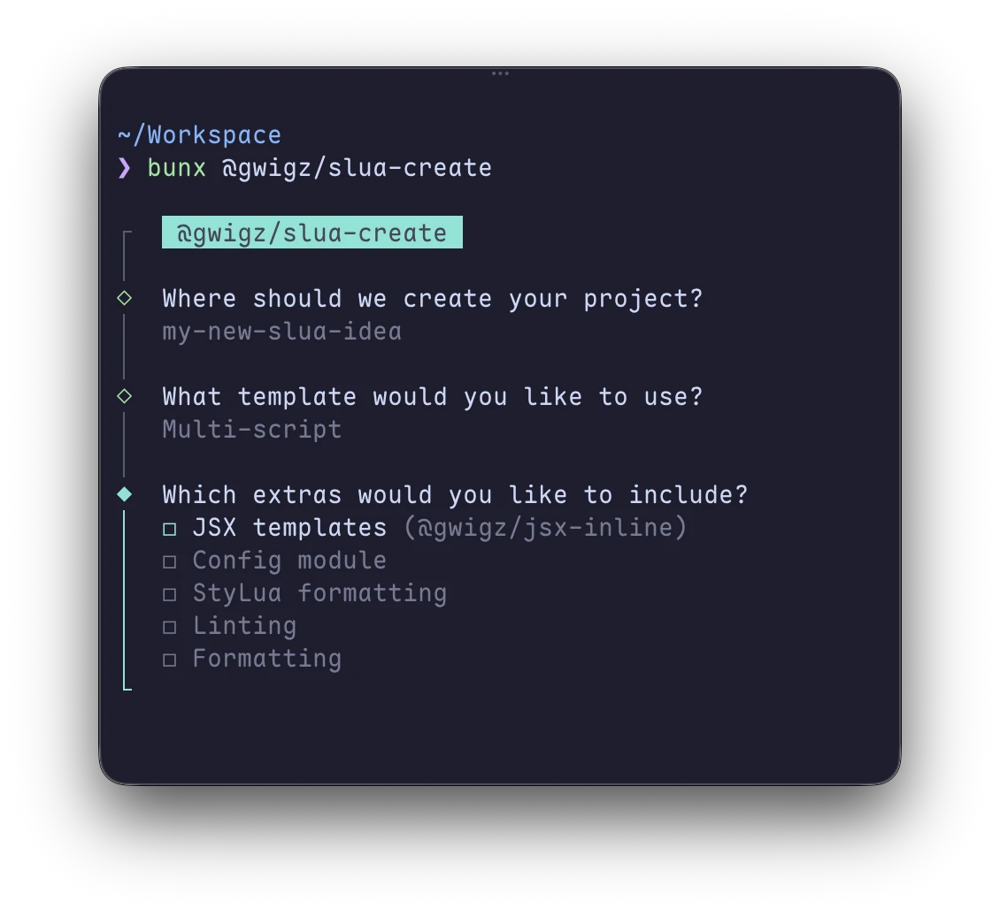

# `@gwigz/slua-create`

Scaffold new TSTL-powered SLua projects.

<p align="center">
  
</p>

## Usage

```bash
npx @gwigz/slua-create
# or
bunx @gwigz/slua-create
```

You can also pass a directory as the first argument:

```bash
npx @gwigz/slua-create my-project
# or
bunx @gwigz/slua-create my-project
```

## Templates

- **Single script** — one `main.ts`, that outputs a single script
- **Multi-script** — custom `build.ts` that can build mutiple scripts

## Extras

| Extra             | Description                                                                            |
| ----------------- | -------------------------------------------------------------------------------------- |
| JSX templates     | [@gwigz/jsx-inline](https://github.com/gwigz/slua/tree/main/packages/jsx-inline)       |
| Config module     | [@gwigz/slua-modules/config](https://github.com/gwigz/slua/tree/main/packages/modules) |
| StyLua formatting | Lua output formatting via [StyLua](https://github.com/JohnnyMorganz/StyLua)            |
| Linting           | TypeScript linting via [oxlint](https://oxc.rs)                                        |
| Formatting        | TypeScript formatting via [oxfmt](https://oxc.rs)                                      |
