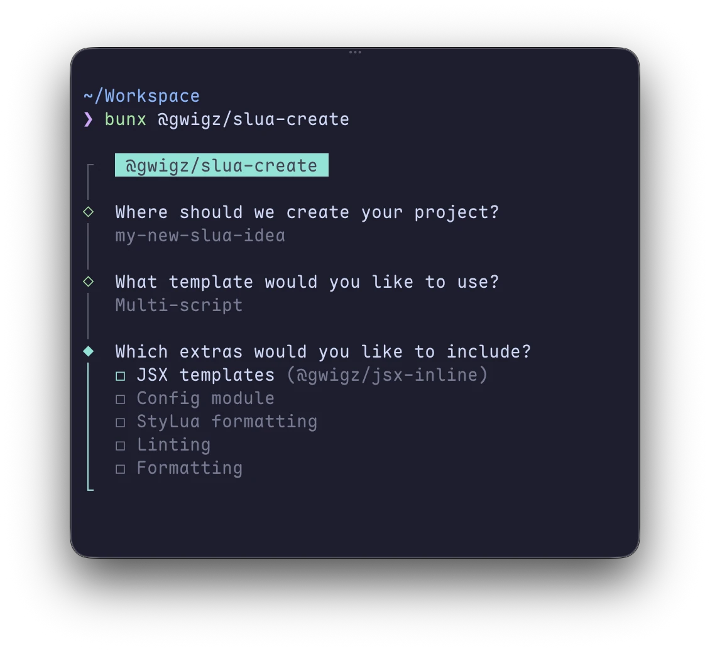

# `@gwigz/slua-create`

Scaffold new TSTL-powered SLua projects.

<p align="center">
  
</p>

## Usage

```bash
npx @gwigz/slua-create
# or
pnpm dlx @gwigz/slua-create
# or
bunx @gwigz/slua-create
```

You can also pass a directory as the first argument:

```bash
npx @gwigz/slua-create my-project
# or
pnpm dlx @gwigz/slua-create my-project
# or
bunx @gwigz/slua-create my-project
```

### Options

```
-t, --template <single|multi>  project template (default: single)
-e, --extras <list>            comma-separated extras, or "none"; repeatable
    --git / --no-git           initialize a git repository (default: git)
    --install / --no-install   install dependencies (default: install)
-y, --yes                      accept defaults for all unanswered prompts
-h, --help                     show this help
-v, --version                  show version
```

Any option answered by a flag is skipped when prompting. With `--yes` (or when
not attached to a terminal, e.g. in CI) no prompts are shown, and the
directory argument is required:

```bash
npx @gwigz/slua-create my-project -y -t multi -e config,yield --no-git
```

## Templates

- **Single script** provides one `main.ts`, that outputs a single script
- **Multi-script** provides a custom `build.ts` that can build mutiple scripts

## Extras

| Extra             | Description                                                                                                                                      |
| ----------------- | ------------------------------------------------------------------------------------------------------------------------------------------------ |
| JSX templates     | [@gwigz/jsx-inline](https://github.com/gwigz/jsx-inline)                                                                                         |
| Config module     | [@gwigz/slua-modules/config](https://github.com/gwigz/slua/tree/main/packages/modules)                                                           |
| Utilities module  | [@gwigz/slua-modules/utilities](https://github.com/gwigz/slua/tree/main/packages/modules)                                                        |
| Yield module      | [@gwigz/slua-modules/yield](https://github.com/gwigz/slua/tree/main/packages/modules)                                                            |
| StyLua formatting | Lua output formatting via [StyLua](https://github.com/JohnnyMorganz/StyLua)                                                                      |
| Linting           | TypeScript linting via [oxlint](https://oxc.rs) with [@gwigz/slua-oxlint-config](https://github.com/gwigz/slua/tree/main/packages/oxlint-config) |
| Formatting        | TypeScript formatting via [oxfmt](https://oxc.rs)                                                                                                |

## Documentation

Full API reference and usage examples are available at [slua.gwigz.link/docs/create](https://slua.gwigz.link/docs/create).
